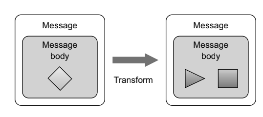

## 关于camel的数据转化

### 这个章节包含

- 使用EIPs and java进行数据转化
- 转化 xml数据
- 使用常用的数据格式 进行转化数据
- 为转换编写您自己的数据格式
- 了解骆驼型转换器的机制

  	上一章介绍了路由，这是任何集成工具包都必须提供的、最重要的单一特性。本章将介绍第二个最重要的特性:`数据`或`消息转换`。 

​	就像人们说不同语言的现实世界一样，IT世界也说不同的协议。当IT系统必须集成时，软件工程师经常需要充当各种协议之间的中介角色。为了 解决这个问题，协议使用的数据模型必须从一种形式转换为另一种形式，

适应接收方所理解的任何协议。中介和数据转换是任何集成工具包中的关键特性，包括Camel。 

​	在本章中，您将了解所有关于Camel如何帮助您应对数据转换挑战。我们将首先简要概述Camel中的数据转换，然后查看将数据转换为您可能拥有的任何 

自定义格式。接下来，我们将研究专门用于转换XML数据和其他著名数据格式 

的Camel组件。最后一章，我们将研究Camel的类型转换机制，它隐式和显式 

地支持类型转换。 

​	阅读本章后，您将知道如何处理您所面临的任何数据转换，以及要使用哪 

种Camel解决方案。

**3.1** **数据转换概述**

Camel提供了许多数据转换技术，我们很快将介绍它们。但让我们从对Camel 

中的数据转换的概述开始。数据转换是一个广义的术语，涵盖了两种类型的转换：

- 数据格式转换—消息正文的数据格式从一种表单转换为另一种形式。例如，CSV记录被格式化为XML。 

- *数据类型转换—消息正文的数据类型将从一种类型转换为另一种类型。*例如，`java.lang.String`被转换为`javax.jms.TextMessage`

  

  图3.1说明了将消息体从一种形式转换为另一种消息体的原理。此转换可以涉 

  及格式和类型转换的任何组合。在大多数情况下，使用Camel将面临的数据转 

  换是格式转换：您必须在两个协议之间进行调解。Camel具有一个内置的类型 

  转换器机制，可以自动转换到类型之间，这大大减少了最终用户处理类型转换 

  的需要。 

  

   

  ​		图3.1 **camel提供了许多可以将数据从一种表** **单转换到另一种表单的特性。**

​	Camel有许多数据转换特性。我们将在下一节中介绍它们，然后逐一介绍它 

们。阅读本章后，您将深入了解如何使用Camel来转换数据。在Camel中，数 

据转换通常以表3.1中列出的六种方式进行。

**表3.1数据转换通常是在Camel中进行的六种方式**

| 转化                                  | 描述                                                         |
| ------------------------------------- | ------------------------------------------------------------ |
| 使用`eips`和`Java`进行数据转换        | 您可以通过使用消息转换器或内容使其更丰富的EIP来显式          |
| 使用组件进行数据转换                  | Camel为转换提供了一系列组件，例如用于XML转换的XSLT 组件。我们将在第3.3节中深入讨论这个问题。 |
| 使用数据格式进行数据转换              | 数据格式是Camel转换器，它成对出现，可以在著名的格式之间来回转换数据。第3.4节涵盖了此主题。 |
| 使用模板进行数据转换                  | Camel提供了一系列组件，可以通过使用模板进行转换， 如Apache速度。我们将在第3.5节中讨论这个问题 |
| 使用Camel的类型转换器机制进行数据转化 | Camel有一个复杂的类型转换器机制，可以按需使用。 当您需要从`java.lang.Integer`等公共类型进行转换时，这很方便。整数到`java.lang.String`，甚至从`java.io.File` 到`java.lang.String` 第3.6节包括类型转换器。 |
| 使用组件适配器进行消息转换            | Camel的许多组件可以适应各种常用的协议，因此，需要能 够在往返于这些协议时转换消息。这些组件通常使用自定义 数据转换和类型转换器的组合。这可以无缝地发生，只有组件编写者才需要担心它。第8章涵盖了编写自定义组件。 |

本章包含了前面五个数据转换的框架的方法。最后一个使用组件适配器消息转化我们将留给第8章，因为它只适用于编写自定义组件。

**3.2** **通过使用EIPs和Java来转换数据**

​	`Data Mapping`是两种不同数据模型之间的映射过程，是数据集成的一个关键因素。 有许多现有标准的数据模型，由各种开源社区管理。因此，您通常会发现自己需要从公司的自定义数据模型映射到标准数据模型。 

​	Camel在数据映射方面提供了极大的自由度，因为它允许您使用Java代码。 

您并不局限于使用一个特定的数据映射工具，该工具在可能看起来很优 

雅，但结果却使事情变得不可能。 

​	在本节中，您将通过使用CamelAPI处理器来查看映射数据。Camel还可以使用Javabean进行映射，这是一个很好的实践，因为它允许您 的映射逻辑独立于CamelAPI。

